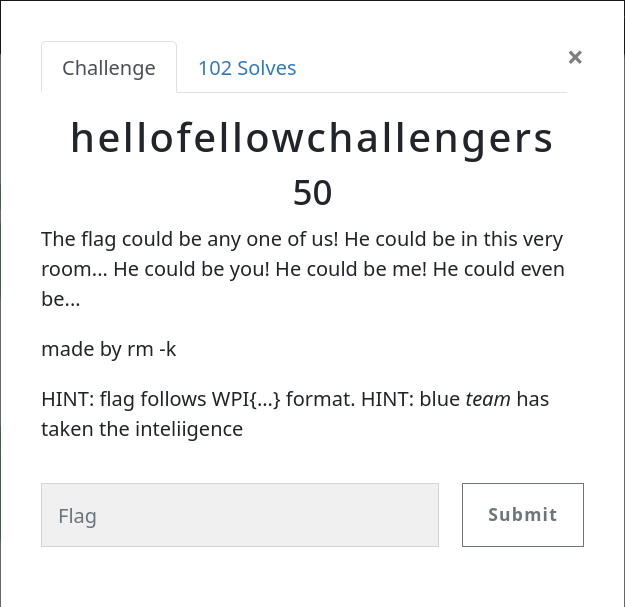

# Challenge - inspector

## # Challenge Details




"The flag could be any one of us! He could be in this very room... He could be you! He could be me! He could even be..."

So from this I got that either some users name is flag or either any teams name, So I wrote a python script for download all users and teams name.

### # Script

```python
import requests
import re

for x in range(1,22):
    url = 'https://ctf.wpictf.xyz/teams?page='+str(x)
    print("Url:", url)
    response = requests.get(url)
    pattern = r'(<a href="/teams/\d*">)(\s)*(.*)(\s)*</a>'
    matches = re.findall(pattern, response.text)
    for match in matches:
        print(match[2])
        with open("teams.txt", "a") as f:
            f.write(match[2]+"\n")
```


Similarly for users name I just changed users in url and in pattern and then saved in users.txt

### # FLAG

So after saving all names of users and teams I searched pattern WPI{...}

And I found *WPI{y000h}* in users.txt but unfortunately this was not flag.

Then I found **WPI{the_best_teams_make_the_flags}** in teams.txt and this was correct flag.
