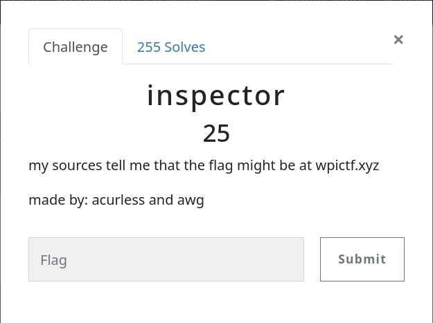
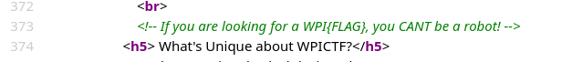
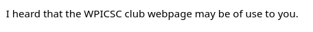
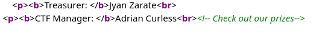
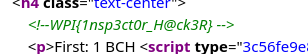

# Challenge - inspector

## # Challenge Details

As Details says "my sources tell me that the flag might be at wpictf.xyz", I had to visit wpictf.xyz

After visiting wpictf.xyz, and checking source code of page, I found a comment

### # Comment

So as per comment, I checked robots.txt on wpictf.xyz/robots.txt

### # robots.txt

So as per robots.txt, I checked inspector.txt on wpictf.xyz/inspector.txt

### # inspector.txt

So this file says we should check out WPICSC club webpage, And by simple Google search we can see that WPICSC Club webpage is on https://web.cs.wpi.edu/~csc/. After opening this webpage and checking source code, I found this comment by CTF Manger

### # Comment

So as per instructions I opened prizes page on https://ctf.wpictf.xyz/prizes and checked source code and found flag

### #FLAG

So all in all good challenge, just needed to follow multiple instructions :D